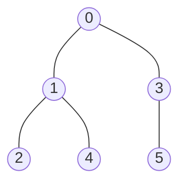
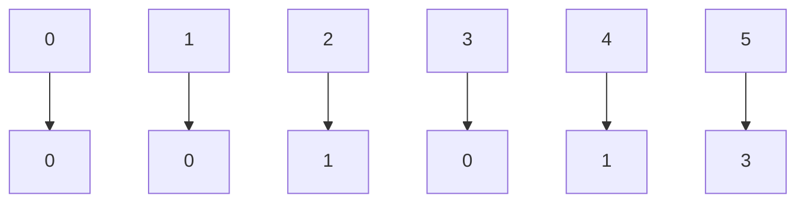
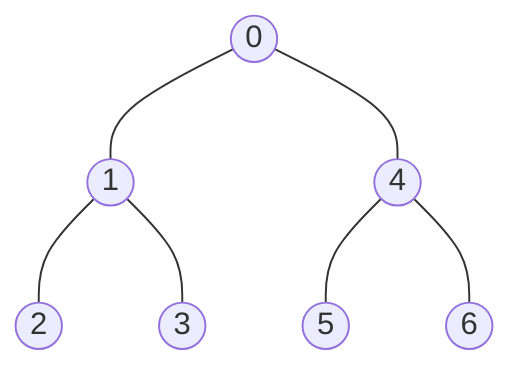
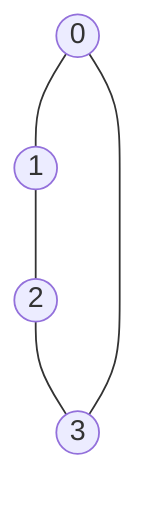
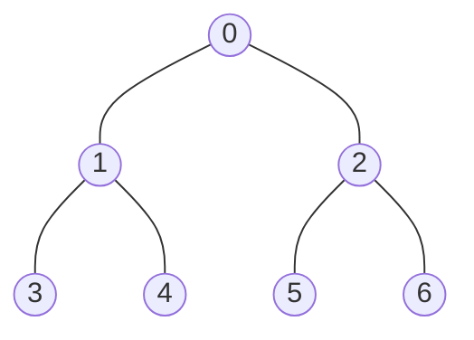
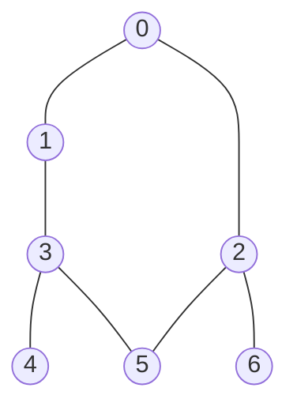
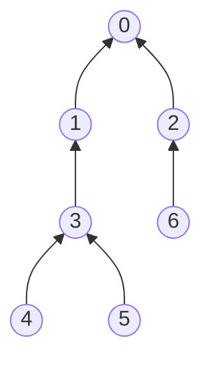
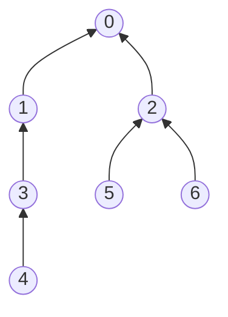

# 图算法

## 无向图

### 术语

- **相邻**：⓪-① 1与0相邻
- **依附**：⓪-① 该连接依附于0和1
- **度数**：⓪-①-② 1的度数为2(依附于它的边的总数)
- **子图**：一幅图所有边的子集
- **路径**：由边顺序连接的一系列节点
- **(简单)路径**：一条没有重复节点的路径
- **环**：至少包含一条起点终点相投的路径
- **(简单)环**：起点和终点相同其他节点不同，环的长度等于边的个数
- **连通**：⓪-① 1与0连通
- **连通图**：可以从任一顶点到达任一其他点
- **极大连通子图**：非连通图有多个连通图构成
- **无环图**：没有环的图
- **树**：一种无环图(连通图,去掉任意一边便不全连,加任一边便产生环,任一两点只有一种路径)
- **森林**：互不相连的数组成的集合
- **生成树**：连通图的生成树是它的一副子图，含有所有的顶点
- **生成树森林**：同理
- **密度**：已经连通的点占所有点对的比例（分为稠密图和稀疏图）
- **二分图**：将所有的节点分为两部分，每条边的两个节点都能属于不同部分


### 无向图基本API

| 接口                  | 操作                          | 返回类型 |
| --------------------- | ----------------------------- | -------- |
| Graph(int v)          | 创建一个含有V个点无边的无向图 | 构造函数 |
| V()                   | 查看顶点数                    | int      |
| E()                   | 查看边数                      | int      |
| addEdge(int v, int w) | 向图中添加一条v-w边           | int      |
| adj(int v)            | 查看v相邻的点                 | Bag<int> |

#### 数据类型

对于**无向图**的数据类型，我们选用**邻接表数组**。**邻接表数组**即一个数组内的每个元素维护一个bag对象，由于c++没有Bag对象，我们将进行定义。Bag对象的特点类似于链表，可以不断添加，但Bag不能删除元素，因为基本api并不要求删除，若要求，可以换个类型例如链表。

#### Undigraph头文件

```c++
// 代码中Undigraph显示为Graph
class Graph
{
public:
    Graph(int v);
    Graph(const Graph &G);
    ~Graph() { delete[] _adj; }

    int V() { return vertex_num; };
    int E() { return edge_num; };

    void addEdge(int v, int w);
    Bag<int> adj(int v) {return _adj[v];} ;
 
    Graph &operator=(const Graph &G);
    friend std::ostream &operator<<(std::ostream &os, const Graph &G);

private:
    int vertex_num;
    int edge_num;
    Bag<int> *_adj;
};
```

分析：

而对于无向图的实现，我们还可以使用**邻接矩阵**，使用V*V的布尔值二维数组，但是将要花费V平方级别的内存空间，百万个点的图也是很常见的，这样的花销十分不值得。

我们还可以使用**边的数组**，使用一个Edge类，有两个int成员变量来代表连接的两个点，但是对于adj()的实现，便要遍历整个边的数组，时间花费成本高达O(E)。

对于**邻接表数组**，添加边的操作，时间复杂度为O(1)。adj()函数实现也只需要查看对应数组内的Bag内容即可。优点：性能好 缺点：内存占用大(但是相对于邻接矩阵，可以省下相当的空间大小)。

### 无向图算法

#### 图连接查找 API
| 接口                   | 操作                      | 返回类型 |
| ---------------------- | ------------------------- | -------- |
| Search(Graph G, int s) | 找到和起点s连通的所有顶点 | 构造函数 |
| marked(int v)          | v和s是否连通              | bool     |
| count()                | 与s连通的顶点总数         | int      |

#### 寻找路径算法 API

| 接口                 | 操作                               | 返回类型 |
| -------------------- | ---------------------------------- | -------- |
| Path(Graph G, int s) | 创建一个储存寻找路径的Path对象     | 构造函数 |
| hasPathTo(int v)     | 是否存在从s到v 的路径              | bool     |
| pathTo(int v)        | s到v的路径，如果不存在，返回空序列 | int      |

#### Search 头文件

```c++
class Search
{
public:
    Search(Graph G, int s);
    bool marked(int v) { return _marked[v]; };
    int count() const { return _count; };
    ~Search() { delete[] _marked; }

private:
    void dfs(Graph G, int s);
    void bfs(Graph G, int s);

    bool *_marked = nullptr;
    int _count = 0;
    int root_node;
};

```

#### Path头文件

```c++
class Path
{
public:
    Path(Graph G, int s);
    ~Path() { delete[] _marked; }

    Bag<int> pathTo(int v);
    bool hasPathTo(int v) { return _marked[v]; };
    bool marked(int v) { return _marked[v]; };
    int count() const { return _count; };

private:
    void dfs(Graph G, int s);
    void bfs(Graph G, int s);

    bool *_marked = nullptr;
    int *edgeTo = nullptr;
    int _count = 0;
    int root_node;
};
```

这里我们将会介绍图算法中最基本的两种算法，以用来解决上面两种问题，由于上面的两种问题具有共通性，于是放在一起介绍。

关于路径搜索

```c++
Bag<int> Path::pathTo(int v)
{
    if (!hasPathTo(v))
        return Bag<int>();
    Bag<int> path;
    for (int x = v; x != root_node; x = edgeTo[x])
    {
        path.add(x);
    }
    path.add(root_node);
    Bag<int> reserve(path);
    return reserve;
}
```

我们在Search的基础上进行修改即可，Search需要遍历起点连通的所有点。Path也需要遍历所有点。对于路径搜索，只需要在遍历到点的时候，将该点连接到上一个点即上面的edgeTo[v] = s;这一句。路径搜索需要额外维护一个数组edgeTo，以用来保存每个点指向根节点的路径，以便在pathTo函数中，输出点的路径。

当查找点v到s的路径时，若v在以s为根节点的树内，则_marked[v]应当为true(v点在遍历中被标记)，此时，寻找关于点v到s的路径，只需要按照树的连接，从子节点不断输出到根节点。



以上图为例此时edgeTo数组为（第一行为数组下标，第二行为其值）



#### Search&Path实现一：DFS深度优先搜索（Deep First Search）

思路：

1.访问一个顶点时，将其标记为已访问。

2.递归地访问没有被标记的邻接顶点。

实现：

#### Search

```c++
Search::Search(Graph G, int s) : _marked(new bool[G.V()]{false}),  root_node(s)
{
    dfs(G, s);
}

void Search::dfs(Graph G, int s)
{
    _marked[s] = true;
    for (int v : G.adj(s))
    {
        if (!_marked[v])
        {
            dfs(G, v);
            _count++;
        }
    }
}
```

#### Path

```c++

Path::Path(Graph G, int s) : _marked(new bool[G.V()]{false}), edgeTo(new int[G.V()]), root_node(s)
{
    dfs(G, s);
}

void Path::dfs(Graph G, int s)
{
    _marked[s] = true;
    for (int v : G.adj(s))
    {
        if (!_marked[v])
        {
            edgeTo[v] = s;
            dfs(G, v);
            _count++;
        }
    }
}
```

分析：DFS的核心思路是广度优先，也因此主要实现方法就是递归



**DFS**的搜索顺序如上图的序号，从0-6。主要操作的函数是dfs，在对点进行dfs操作时，标记这个点并遍历它邻接的每一个点，若接下来的点没有被标记（没有dfs过）就对其进行dfs。并且在寻找路径算法的实现中也多添加了edgeTo[v] = s;以用来连接点而记录路径。然而，当我们需要找到最短路径的时候，DFS并不能达到其效果



对于以上图，当使用**DFS**的广度优先搜索时，输出3-0的路径，可能为3 -> 2 -> 1 -> 0 而并不是最短路径 3 -> 0

此时，我们提出**BFS**广度优先搜索。

#### Search&Path实现二：BFS广度优先搜索（Breadth First Search）

目的：为了实现最短路径搜索，我们希望图按照以下0-6的顺序搜索，这样便可达到目的，若存在短的路径，将会先被记录进edgeTo数组。实现BFS广度优先搜索就不能使用递归的方法。



思路：

1.维护一个队列queue，用来储存即将被查找的点。

2.从队列中取出一个点，对其进行操作，并将其邻接的没有被记录过的点全部加入队列。

3.重复2的操作直至队列为空。

实现：

#### Search

```c++
Search::Search(Graph G, int s) : _marked(new bool[G.V()]{false}), root_node(s)
{
    bfs(G, s);
}

void Search::bfs(Graph G, int s)
{
    std::queue<int> que_marked;
    _marked[s] = true;
    que_marked.push(s);
    while (!que_marked.empty())
    {
        int v = que_marked.front();
        que_marked.pop();
        for (int w : G.adj(v))
        {
            if (!_marked[w])
            {
                _marked[w] = true;
                que_marked.push(w);
                _count++;
            }
        }
    }
}
```

#### Path

```c++
void Search::bfs(Graph G, int s)
{
    std::queue<int> que_marked;
    _marked[s] = true;
    que_marked.push(s);
    while (!que_marked.empty())
    {
        int v = que_marked.front();
        que_marked.pop();
        for (int w : G.adj(v))
        {
            if (!_marked[w])
            {
                _marked[w] = true;
                que_marked.push(w);
                _count++;
            }
        }
    }
}
```

分析：**BFS**也即是广度优先，以广度（和起点最近）为优先。借此我们也能解决最短路径的问题。

###  对比DFS和BFS

我们将对以下这幅图分别进行DFS和BFS的搜索，并记录结果



#### DFS



#### BFS



分析：由上图的对比可见 **DFS**忽略边5-2 而**BFS**忽略 5-3， 此时对5进行路径查找

**DFS**的路径将会是5 -> 3 -> 1 -> 0, **BFS**的路径将会是5 -> 2 -> 0

由上可得，**BFS**生成的树深度会最小，而**DFS**不能保证，但为了实现**BFS**，我们需要额外维护一个队列。

### 拓展

两者的用途：

**BFS**：找到最小路径

**DFS**：找到目标，判断是否有环，判断是否为二分图

#### 判断是否有环

思路：利用无环图在**DFS**中不会出现重复遍历的特点，若出现了重复遍历，需要判断其是否为根节点，若不是，则包含环

#### 判断是否为二分图

思路：用color来标识两种集合，已知无环图必为二分图，所以只需要查看有环部分是否成立即可。

