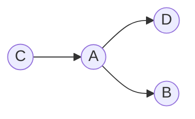
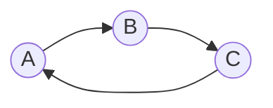
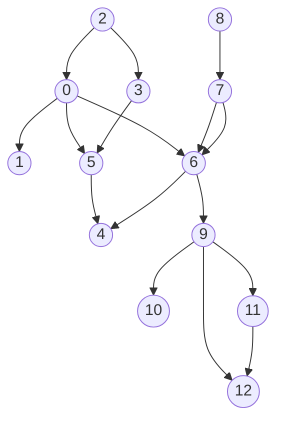
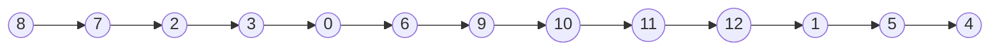
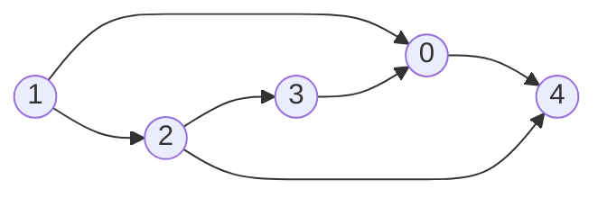
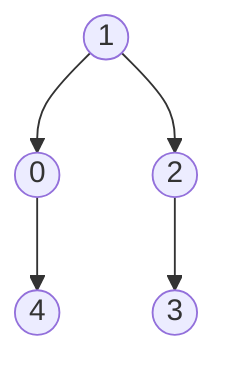
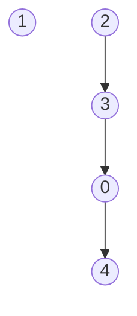
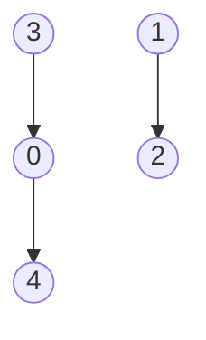
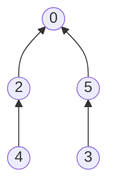

## 有向图

特点：每条边都是有方向的，从一个顶点到另一个顶点

术语：

- **指出**：⓪→① 顶点0指出顶点1
- **出度**：对于⓪→①→②  0和1 都各有一条出度
- **入度**：1 和 2 都各有一条入度
- **头**：一条有向边的第一个顶点
- **尾**：与头相反
- **有向路径**：由一系列顶点和有向边组成如⓪→①→②
- **简单有向环**：除起点和终点其它各不相同
- **长度**：包含的边数
- **达到**：当有⓪→① 则 1能由0达到
- **强连通**：对于⓪，①若存在⓪→① 的路径也存在①→⓪的路径，则称0，1强连通
- **强连通分量**：对于同一强连通分量的顶点，任一两点都强连通

### 有向图基本API

| 接口                  | 操作                          | 返回类型 |
| --------------------- | ----------------------------- | -------- |
| Digraph(int v)        | 创建一个含有V个点无边的无向图 | 构造函数 |
| V()                   | 查看顶点数                    | int      |
| E()                   | 查看边数                      | int      |
| addEdge(int v, int w) | 向图中添加一条v-w边           | int      |
| adj(int v)            | 查看v的出度                   | Bag<int> |
| reverse()             | 该图的反向图                  | Digraph  |

#### 概要

有向图的基本api和无向图的区别在于有向图有reverse()函数用于生成一张反向图，其实现也十分简单。还有一点就是adj函数变成用于查询出度。这都是由于有向图的实现方式，有向图我们依旧使用邻接表数组，但是原来的边会记录两次，分别为该边连接的两点，但有向图为了体现边的有向性，将一条有向边只记录一次，记录在指出这条边的点。既然如此，reverse函数的实现也变得简单，只需要创建一个新有向图，遍历邻接表中的每一个点的出度（也就是遍历所有有向边）并将原本的有向边的尾记录为新的头。

#### Digraph头文件

```c++
class Digraph
{
public:
    Digraph(int v);
    Digraph(const Digraph &G);
    ~Digraph() { delete[] _adj; }

    int V() { return vertex_num; };
    int E() { return edge_num; };

    void addEdge(int v, int w);
    Bag<int> adj(int v) { return _adj[v]; };

    Digraph reverse();

    Digraph &operator=(const Digraph &G);
    friend std::ostream &operator<<(std::ostream &os, const Digraph &G);

private:
    int vertex_num;
    int edge_num;
    Bag<int> *_adj;
};
```

#### addEdge的改变

```c++
inline void Digraph::addEdge(int v, int w)
{
    for (int temp : adj(v))
        if (temp == w)
            return;
    if (v == w)
        return;
    _adj[v].add(w); // 有向图只加一边
    edge_num++;
}
```

#### reverse的实现

```c++
Digraph Digraph::reverse()
{
    Digraph reverse_digraph(vertex_num);
    for (int i = 0; i < vertex_num; i++)
        for (int v : _adj[i])
            reverse_digraph.addEdge(v, i);
    return reverse_digraph;
}
```

### 有向图算法

#### 有向图的可达性API

| 接口                          | 操作                      | 返回类型 |
| ----------------------------- | ------------------------- | -------- |
| DirectedDFS(Digraph G, int s) | 找到和起点s连通的所有顶点 | 构造函数 |
| DirectedDFS(Digraph G, Bag<int> b) | 找到和一组起点连通的所有顶点 | 构造函数 |
| marked(int v)                 | v和s(一组起点)是否连通        | bool     |


有向图的可达性也就是主要利用DFS和BFS的算法，会如同一下的有向图的寻路。

#### 有向图的寻路API
| 接口                 | 操作                               | 返回类型 |
| -------------------- | ---------------------------------- | -------- |
| Path(Digraph G, int s) | 创建一个含有V个点无边的无向图      | 构造函数 |
| hasPathTo(int v)     | 是否存在从s到v 的路径              | bool     |
| pathTo(int v)        | s到v的路径，如果不存在，返回空序列 | int      |

#### DFS

```c++
Path::Path(Digraph G, int s) : _marked(new bool[G.V()]{false}), edgeTo(new int[G.V()]), root_node(s)
{
    dfs(G, s);
}

void Path::dfs(Digraph G, int s)
{
    _marked[s] = true;
    for (int v : G.adj(s))
    {
        if (!_marked[v]){
            edgeTo[v] = s;
            _count++;
            dfs(G, v);
        }
    }
}
```

#### BFS

```c++
Path::Path(Digraph G, int s) : _marked(new bool[G.V()]{false}), edgeTo(new int[G.V()]), root_node(s)
{
    bfs(G, s);
}

void Path::bfs(Digraph G, int s)
{
    using namespace std;
    queue<int> b_que;
    _marked[s] = true;
    b_que.push(s);
    while (!b_que.empty())
    {
        int v = b_que.front();
        b_que.pop();
        for (int w : G.adj(v))
        {
            if (!_marked[w])
            {
                _marked[w] = true;
                edgeTo[w] = v;
                b_que.push(w);
                _count++;
            }
        }
    }
}

```

分析：BFS和DFS在有向图中依旧可以使用，甚至代码几乎没有什么变化，此处作为复习。同理只有BFS的实现才是最短路径。

#### 拓扑排序

情景：此时你需要为一些任务进行排序，而且，这些任务中的部分包含先后顺序的要求，例如存在任务ABCD其中D需要在A之后完成，C要在A之前完成，B要在A之后完成。此时如何排序就成为一种实际问题。

对这种问题进行抽象化，将任务抽象化为一个顶点，之间的先后要求抽象成有向边此时我们可以得到



对于以上的描述，我们得到一张十分简单的有向图，虽然此时我们能一下分辨先后，但是如果有多个顶点，任务就复杂起来。我们需要一种算法，来解决这种问题。

思考：为了确保任务的顺利完成，我们先要排除**不可处理的情况**。此时，对于可进行这种排序的有向图，它一定是无环的，若有环，例如对于任务ABC，如下图所示，根本无法进行排序。所以在解决问题之前，我们应该先排除有向环的存在。



#### 寻找有向环API

#### 有向图的寻路API
| 接口                     | 操作                           | 返回类型 |
| ------------------------ | ------------------------------ | -------- |
| DirectedCycle(Digraph G) | 寻找有向环构造函数             | 构造函数 |
| hasCycle()               | G是否存在有向环                | bool     |
| cycle()                  | 有向环中的所有顶点（如果存在） | Bag<int> |

头文件

```c++
class DirectedCycle
{
public:
    DirectedCycle(Digraph G);
    ~DirectedCycle(){ delete [] onStack, edgeTo;}
    bool hasCycle() { return !_cycle.isEmpty(); };
    Bag<int> cycle() { return _cycle; };

private:
    void dfs(Digraph G, int s);

    Bag<int> _cycle;
    bool *marked;
    bool *onStack;
    int *edgeTo;
};
```

思路：和无向图的搜索环类似，利用深度优先搜索，记录当前的路径，若出现重复顶点又不是根节点，即为环。此时要获取环，只需要利用edgeTo数组的链接即可。

实现：

```c++
DirectedCycle::DirectedCycle(Digraph G) : marked(new bool[G.V()]), onStack(new bool[G.V()]), edgeTo(new int[G.V()])
{
    for (int i = 0; i < G.V(); i++)
    {
        if (!marked[i])
        {
            dfs(G, i);
        }
    }
}

void DirectedCycle::dfs(Digraph G, int s)
{
    onStack[s] = true;
    marked[s] = true;
    for (int v : G.adj(s))
    {
        if (hasCycle())
            return;
        else if (!marked[v])
        {
            edgeTo[v] = s;
            dfs(G, v);
        }
        else if (onStack[v])
        {
            Bag<int> cc;
            for (int x = s; x != v; x = edgeTo[x])
                cc.add(x);
            cc.add(v);
            cc.add(s);
            _cycle = cc;
        }
    }
    onStack[s] = false;
}
```

#### 拓扑排序

解决了环的判定，此时我们就可以进入正题了，这种排序的名称为**拓扑排序**

要求：给定一有向图，将所有的顶点排序，使所有顶点只能指向排在后面的点。

示例：



以上图的排序结果(理想)：



#### 拓扑排序API

| 接口                           | 操作                        | 返回类型 |
| ------------------------------ | --------------------------- | -------- |
| Topological(WeightedDigraph G) | 对有向图G的节点进行拓扑排序 | 构造函数 |
| isDAG()                        | 图是否有环                  | bool     |
| order()                        | 返回拓扑排序的结果          | Bag<int> |

头文件

```c++
class Topological
{
public:
    Topological(WeightedDigraph G);
    ~Topological() { delete[] marked, onStack; }

    bool isDAG() const { return !resOrder.isEmpty(); };
    Bag<int> order() const { return resOrder; };

private:
    bool *marked;
    bool *onStack;
    Bag<int> resOrder;

    void dfs(WeightedDigraph G, int v);
};
```

思路：

1.根据拓扑排序遍历顶点

2.每次dfs操作后将点加入栈

3.遍历结束后栈的结果即为拓扑排序顺序

实现：

```c++
Topological::Topological(WeightedDigraph G) : marked(new bool[G.V()]), onStack(new bool[G.V()])
{
    DirectedCycle dc(G);
    if (!dc.hasCycle())
    {
        dfs(G, 0);
    }
}
void Topological::dfs(WeightedDigraph G, int v)
{
    marked[v] = true;
    for (int w : G.adj(v))
    {
        if(!marked[w])
            dfs(G, w);
    }
    resOrder.add(v);
}
```

分析：主要的实现方法为DFS。首先，DFS会遍历所有的点，其次拓扑排序不一定只有一种结果。以下图为例。



**当从0开始**进行DFS(先0->4再1->2->3)被忽略的关系2 -> 4 ; 3 -> 0 ; 1 -> 0;


**当从1开始**，被忽略的关系3 -> 0; 2->4



**当从2开始**，被忽略的关系1 -> 0; 1 -> 2; 2 -> 4



**当从3开始**，被忽略的关系1 -> 0; 2 -> 3; 2 -> 4



分析：以上可发现被无视的有向边均为新节点指向旧树。也就是说**旧节点不可能再指向新节点**，它们应当被放在排序的最后端。

原因：DFS保证生成的树已为最深，确保遍历了每个点的指向，以保证不会再有旧节点指向新的节点，不会被指向的节点作为排序尾理所应当，故不断排入尾即可。最后再利用stack逆序。

#### 有向图强连通分量API

| 接口                            | 操作                 | 返回类型 |
| ------------------------------- | -------------------- | -------- |
| SCC(WeightedDigraph G)          | 查找G图中的          | 构造函数 |
| stronglyConnected(int v, int w) | 查看w，v点是否强连通 | bool     |
| count()                         | 查看强连通分量的数量 | int      |
| id(int v)                       | 查看v点所在连通分量  | int      |

头文件

```c++
class SCC
{
public:
    SCC(WeightedDigraph G);
    ~SCC() { delete[] _id, marked; }

    bool stronglyConnected(int v, int w) const { return _id[w] == _id[v]; };
    int count() const { return _count; };
    int id(int v) const { return _id[v]; };

private:
    void dfs(WeightedDigraph G, int s);

    int *_id;
    bool *marked;
    int _count = 0;
};
```

有向图也存在连通性问题，但在有向图中，被称为**强连通性**。在一条有向环中，各个顶点都互相强连通。

##### Kosaraju算法

思路：

1.利用DFS的拓扑排序（DFO）对G的反向图进行排序

2.按照1得到的顺序对G进行DFS

3.其中同一个DFS中遇到的点都在同一个强连通分量中

实现：

```c++
SCC::SCC(WeightedDigraph G) : _id(new int[G.V()]), marked(new bool[G.V()])
{
    Topological ts(G.reverse());
    for (int s : ts.order())
    {
        if (!marked[s])
        {
            dfs(G, s);
            _count++;
        }
    }
}

void SCC::dfs(WeightedDigraph G, int v)
{
    marked[v] = true;
    _id[v] = _count;
    for (int w : G.adj(v))
        if (!marked[w])
            dfs(G, w);
}

```

分析：**Kosaraju算法**简单但难以理解，首先要理解DFO在有环图中的排序行为。

深入**拓扑排序DFO**

1.DFO一棵树内关系

DFO对第一个起点进行DFS，即从起点生成一棵树。其中生成的第一颗树，我们可以发现起点为这个树的**根**，并且对于树的任一节点，都存在起点到节点的**有向路径**。

2.DFO多颗树先后关系

若生成多颗树，即为存在起点无法连接到的点，其中，由于第一颗树保证了深度最大，不会指向后面的节点，换句话说，后面生成的树中的任一节点不会被前面的旧节点指向。

第一步：对G的反向图同样分析

若逆后序为⑥|①|⓪⑤③②④|⑦⑧

其中⑥①不会指向后面的节点⑤③②④有指向⓪的路径。则如果⓪有指向⑤③②④中的任一节点，那必成为一有向环，即为同一连通分量。且⓪⑤③②④中的任一节点不可能指向之后的节点。又⓪⑤③②④是拓扑排序保证了⑤③不可能指向②④，除非在同一树枝上。



例如②可以指向④，⑤可以指向③，这一点是DFO的特性，也保证了Kosaraju算法的正确性。

第二步：

当分析⑥的时候因⑥不可能被后面的任一节点指向。⑥自己成为一分量，分析①同理。

当分析⓪的时候⓪ -> ②则②⑥成为一分量，若就此结束，到⑤的时候，⑤不可能指向④（理由见上文）也不会导致问题。


