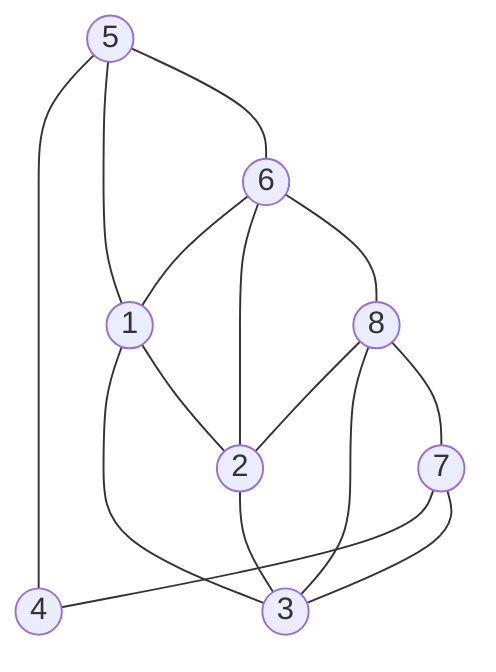

# 加权图
## 数据类型

因为继承体系，我们将图分为有权图和无权图，又各自分为有向和无向。

### 有权图

依旧使用邻接表来实现。

基类头文件

```c++
class BaseGraph
{
public:
    BaseGraph(int v) : vertex_num(v){};
    int V() const { return vertex_num; };
    int E() const { return edge_num; };

protected:
    int vertex_num;
    int edge_num = 0;
};

class BaseWeightedGraph : public BaseGraph
{
public:
    BaseWeightedGraph(int v) : BaseGraph(v) {}
    virtual void addEdge(int v, int w, double weight) = 0;
};
```

### 有权边

将原来的边变为一个新的类型。

基类头文件

```c++
class BaseEdge
{
public:
    BaseEdge() : v(-1), w(-1), weight_(0){};
    BaseEdge(int v, int w, double wei) : v(v), w(w), weight_(wei){};
    double weight() const { return weight_; };
    bool operator>(const BaseEdge &e) const { return e.weight() < this->weight_; }
    bool operator<(const BaseEdge &e) const { return e.weight() > this->weight_; }
    bool operator>=(const BaseEdge &e) const { return !(e > *this); }
    bool operator<=(const BaseEdge &e) const { return !(e < *this); }

protected:
    int v;
    int w;
    double weight_;
};
```


## 最小生成树（MST）

| 接口                 | 操作                       | 返回值    |
| -------------------- | -------------------------- | --------- |
| MST(WeightedGraph G) | 找到图G的最小生成树        | 构造函数  |
| edges()              | 返回最小生成树的所有边     | Bag<Edge> |
| weight()             | 返回最小生成树的边的权值和 | double    |

输入：一幅加权无向图

输出：一颗最小生成树

#### 前提：

- 只考虑连通图（如果一幅图非连通，则只能有最小生成森林）

- 边的权重不一定是距离

- 边的权重可能是0或者负数

- 所有边的权重各不相同（若相同，最小生成树的结果将不唯一，还要外加以证明）

#### 树的特性：

- 删去任一一边都会使树变为两颗
- 加一边必出环

### 预备理论

#### 切分定理

术语：

切分：将图的所有顶点分为两非空不重复集合

横切边：一条连接两个属于不同集合的两个点的边


内容：对一图的任一切分，横切边的最小权重必被最小生成树包含。

证明：反证法（略）

#### 数据类型

这里用到的是有权无向图和有权无向边

##### 有权无向图

头文件

```c++
class WeightedGraph : public BaseWeightedGraph
{
public:
    WeightedGraph(int v) : BaseWeightedGraph(v), _adj(new Bag<Edge>[v]){};
    WeightedGraph(const WeightedGraph &G);
    ~WeightedGraph() { delete[] _adj; }

    void addEdge(int v, int w, double weight);
    void addEdge(const Edge &e);
    Bag<Edge> adj(int v) const { return _adj[v]; };
    Bag<Edge> edges() const;

    WeightedGraph &operator=(const WeightedGraph &G);
    friend std::ostream &operator<<(std::ostream &os, const WeightedGraph &G);

private:
    Bag<Edge> *_adj;
};
```

##### 有权边

将原来的边变为一个新的类型。

基类头文件

```c++
class Edge : public BaseEdge
{
public:
    Edge() : BaseEdge(){};
    Edge(int v, int w, double wei) : BaseEdge(v, w, wei){};
    int either() const { return v; }
    int other(int ver) const;

    bool operator==(const Edge &edge) const { return edge.weight() == this->weight(); }

    friend std::ostream &operator<<(std::ostream &os, const Edge &edge);
};
```

### Prim算法

思路：

1.从树的第一个节点开始，将起点和其他点作为两类利用**切分定理**找到第一处连接

2.再将新连接的点加入原来起点的那一类。对新的两个类的**横切边**进行**切分定理**判断

3.以此类推

分析：由此我们可以发现算法的实现体现了对横切边容器的处理上。对此Prim算法就出现了两种版本，**Prim延时算法**和**Prim即时算法**。两者都利用**优先队列**。

#### Prim延时算法

此时的优先队列维护**边**和**边的权值**，以边的权值作为优先标准。

思路：

1.以一个起点开始，在优先队列中加入其相邻的边。

2.生长出其中权值最小的边，在优先队列中继续添加新增点的相邻边。

3.同上，以此类推。

实现：

```c++
class LazyPrimMST
{
public:
    LazyPrimMST(WeightedGraph G);
    ~LazyPrimMST() { delete[] marked; }
    Bag<Edge> edges() const { return mst; }
    double weight() const;

private:
    edge_pq pq;
    bool *marked;
    Bag<Edge> mst;

    void visit(WeightedGraph G, int v);
};

LazyPrimMST::LazyPrimMST(WeightedGraph G) : marked(new bool[G.V()])
{
    visit(G, 0);
    while (!pq.empty())
    {
        Edge e = pq.top();
        pq.pop();
        int v = e.either(), w = e.other(v);
        if (marked[v] && marked[w])
            continue;
        mst.add(e);
        if (!marked[v])
            visit(G, v);
        if (!marked[w])
            visit(G, w);
    }
}

void LazyPrimMST::visit(WeightedGraph G, int v)
{
    marked[v] = true;
    for (Edge e : G.adj(v))
        if (!marked[e.other(v)])
            pq.push(e);
}
```

分析：其中，按照思路进行时，我们会遇到一些问题。例如以下



问题：对如上图，其中重复边的问题，当2-1-3为当前树的时候，由于加入2节点的时候，优先队列中已经有2-3的边直到依次加入1，3，2-3边依旧存在于优先队列，若此时2-3边出列，然后在树中2，3已经连接了，故会成环出错。

解决：仅需要维护一个布尔值数组marked即可，marked用于标记已经在树内的点，当我们要添加无效边2-3的时候，若23已在树内则不会添加。

分析：也因此特性，在部分边无效的时候，它还存在于队列中，只有在出队的时候才会被删除，故成为Prim延时算法。

#### Prim即时算法

此时的优先队列维护**边**和**边的权值**，以边的权值作为优先标准。

思路：


## 最短路径（SP）

| 接口             | 操作                          | 返回类型    |
| ---------------- | ----------------------------- | ----------- |
| SP               | 创建一个含有V个点无边的无向图 | 构造函数    |
| distTo(int v)    | 从s点到v的距离（权值和）      | double      |
| hasPathTo(int v) | 查看是否存在s到v的路径        | bool        |
| pathTo(int v)    | 从s点到v的路径                | bag<有权边> |


