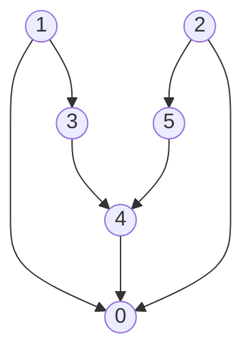

# 加权图
## 数据类型

因为继承体系，我们将图分为有权图和无权图，又各自分为有向和无向。

### 有权图

依旧使用邻接表来实现。

基类头文件

```c++
class BaseGraph
{
public:
    BaseGraph(int v) : vertex_num(v){};
    int V() const { return vertex_num; };
    int E() const { return edge_num; };

protected:
    int vertex_num;
    int edge_num = 0;
};

class BaseWeightedGraph : public BaseGraph
{
public:
    BaseWeightedGraph(int v) : BaseGraph(v) {}
    virtual void addEdge(int v, int w, double weight) = 0;
};
```

### 有权边

将原来的边变为一个新的类型。

基类头文件

```c++
class BaseEdge
{
public:
    BaseEdge() : v(-1), w(-1), weight_(0){};
    BaseEdge(int v, int w, double wei) : v(v), w(w), weight_(wei){};
    double weight() const { return weight_; };
    bool operator>(const BaseEdge &e) const { return e.weight() < this->weight_; }
    bool operator<(const BaseEdge &e) const { return e.weight() > this->weight_; }
    bool operator>=(const BaseEdge &e) const { return !(e > *this); }
    bool operator<=(const BaseEdge &e) const { return !(e < *this); }

protected:
    int v;
    int w;
    double weight_;
};
```


## 最小生成树（MST）

| 接口                 | 操作                       | 返回值    |
| -------------------- | -------------------------- | --------- |
| MST(WeightedGraph G) | 找到图G的最小生成树        | 构造函数  |
| edges()              | 返回最小生成树的所有边     | Bag<Edge> |
| weight()             | 返回最小生成树的边的权值和 | double    |

输入：一幅加权无向图

输出：一颗最小生成树

#### 前提：

- 只考虑连通图（如果一幅图非连通，则只能有最小生成森林）

- 边的权重不一定是距离

- 边的权重可能是0或者负数

- 所有边的权重各不相同（若相同，最小生成树的结果将不唯一，还要外加以证明）

#### 树的特性：

- 删去任一一边都会使树变为两颗
- 加一边必出环

### 预备理论

#### 切分定理

术语：

切分：将图的所有顶点分为两非空不重复集合

横切边：一条连接两个属于不同集合的两个点的边


内容：对一图的任一切分，横切边的最小权重必被最小生成树包含。

证明：反证法（略）

#### 数据类型

这里用到的是有权无向图和有权无向边

##### 有权无向图

头文件

```c++
class WeightedGraph : public BaseWeightedGraph
{
public:
    WeightedGraph(int v) : BaseWeightedGraph(v), _adj(new Bag<Edge>[v]){};
    WeightedGraph(const WeightedGraph &G);
    ~WeightedGraph() { delete[] _adj; }

    void addEdge(int v, int w, double weight);
    void addEdge(const Edge &e);
    Bag<Edge> adj(int v) const { return _adj[v]; };
    Bag<Edge> edges() const;

    WeightedGraph &operator=(const WeightedGraph &G);
    friend std::ostream &operator<<(std::ostream &os, const WeightedGraph &G);

private:
    Bag<Edge> *_adj;
};
```

##### 有权边

将原来的边变为一个新的类型。

基类头文件

```c++
class Edge : public BaseEdge
{
public:
    Edge() : BaseEdge(){};
    Edge(int v, int w, double wei) : BaseEdge(v, w, wei){};
    int either() const { return v; }
    int other(int ver) const;

    bool operator==(const Edge &edge) const { return edge.weight() == this->weight(); }

    friend std::ostream &operator<<(std::ostream &os, const Edge &edge);
};
```

### Prim算法

思路：

1.从树的第一个节点开始，将起点和其他点作为两类利用**切分定理**找到第一处连接

2.再将新连接的点加入原来起点的那一类。对新的两个类的**横切边**进行**切分定理**判断

3.以此类推

分析：由此我们可以发现算法的实现体现了对横切边容器的处理上。对此Prim算法就出现了两种版本，**Prim延时算法**和**Prim即时算法**。两者都利用**优先队列**。

#### Prim延时算法

此时的优先队列维护**边**和**边的权值**，以边的权值作为优先标准。

思路：

1.以一个起点开始，在优先队列中加入其相邻的边。

2.生长出其中权值最小的边，在优先队列中继续添加新增点的相邻边。

3.同上，以此类推。

实现：

```c++
class LazyPrimMST
{
public:
    LazyPrimMST(WeightedGraph G);
    ~LazyPrimMST() { delete[] marked; }
    Bag<Edge> edges() const { return mst; }
    double weight() const;

private:
    edge_pq pq;
    bool *marked;
    Bag<Edge> mst;

    void visit(WeightedGraph G, int v);
};

LazyPrimMST::LazyPrimMST(WeightedGraph G) : marked(new bool[G.V()])
{
    visit(G, 0);
    while (!pq.empty())
    {
        Edge e = pq.top();
        pq.pop();
        int v = e.either(), w = e.other(v);
        if (marked[v] && marked[w])
            continue;
        mst.add(e);
        if (!marked[v])
            visit(G, v);
        if (!marked[w])
            visit(G, w);
    }
}

void LazyPrimMST::visit(WeightedGraph G, int v)
{
    marked[v] = true;
    for (Edge e : G.adj(v))
        if (!marked[e.other(v)])
            pq.push(e);
}
```

分析：其中，按照思路进行时，我们会遇到一些问题。例如以下


问题：对如上图，其中重复边的问题，当2-1-3为当前树的时候，由于加入2节点的时候，优先队列中已经有2-3的边直到依次加入1，3，2-3边依旧存在于优先队列，若此时2-3边出列，然后在树中2，3已经连接了，故会成环出错。

解决：仅需要维护一个布尔值数组marked即可，marked用于标记已经在树内的点，当我们要添加无效边2-3的时候，若23已在树内则不会添加。

分析：也因此特性，在部分边无效的时候，它还存在于队列中，只有在出队的时候才会被删除，故成为Prim延时算法。

#### Prim即时算法

此时的优先队列维护**边**和**边的权值**，以边的权值作为优先标准。

思路：

1.以一个起点开始，将这个点周边的点和它们到起点的边的权值加入队列

2.在增长新的节点后，将新点周边的点和它们到新点的边的权值“设置”入队列

“设置”是指若队列中已存在该点，比较新权值和旧权值，小的留下。若不存在则直接加入

3.以此类推

实现：

```c++
#include "MST.hpp"

class PrimMST
{
public:
    PrimMST(WeightedGraph G);
    ~PrimMST() { delete[] marked, distTo; }
    Bag<Edge> edges() const { return mst; }
    double weight() const;

private:
    point_pq pq;
    bool *marked;
    double *distTo;
    Edge *edgeTo;
    Bag<Edge> mst;

    void visit(WeightedGraph G, int v);
};

PrimMST::PrimMST(WeightedGraph G) : marked(new bool[G.V()]), distTo(new double[G.V()])
{
}

void PrimMST::visit(WeightedGraph G, int v)
{
    marked[v] = true;
    for (Edge e : G.adj(v))
    {
        int w = e.other(v);
        if (marked[w])
            continue;
        if (e.weight() < distTo[w])
        {
            edgeTo[w] = e;

            distTo[w] = e.weight();
            ele new_ele(w, distTo[w]);
            pq_update(pq,  new_ele);
        }
    }
}

void pq_update(point_pq &pq, const ele &new_data)
{
    point_pq temp;
    temp.swap(pq);
    while (!temp.empty())
    {
        ele top_edge = temp.top();
        temp.pop();
        if (new_data.first == top_edge.first)
        {
            pq.push(new_data);
            break;
        }
        else
            pq.push(top_edge);
    }
    while (!temp.empty())
    {
        ele top_edge = temp.top();
        temp.pop();
        pq.push(top_edge);
    }
}
```

分析：树增加节点的方式和延时版相同，从队列中取出最小权值的点，这个时候，我们仅获取了点，不知道是哪条边，故我们应额外维护一个数组edgeTo用来记录各个点的指向。

特点：

1.相比于延时版本，即时版本的特点就在“即时性”，指无效边会被即使删除。

2.需要额外维护数组edgeTo以及数组distTo；edgeTo表示了最小的生成树的边，distTo表示了对应点的边的权值默认全为INF（无穷大）。

3.可以不用marked数组判断是否被记录，因为它和判断distTo是否为INF同理。

4.空间上限变为原来的常数因子。

### KrusKal算法

思路：

1.将所有的边加入优先队列

2.移出最小（权值）的边，加入最小生成树

3.加入生成树时判断边的两点是否已被连接（已在树内）

4.直至MST的数量达到V-1

实现：

```c++
class KurskaiMST
{
public:
    KurskaiMST(WeightedGraph G);
    Bag<Edge> edges() const { return mst; }
    double weight() const;

private:
    Bag<Edge> mst;
};

KurskaiMST::KurskaiMST(WeightedGraph G)
{
    edge_pq pq;
    for (Edge e : G.edges())
        pq.push(e);

    UF uf(G.V());
    while (!pq.empty() and mst.size() < G.V() - 1)
    {
        Edge e = pq.top();
        pq.pop();
        int v = e.either(), w = e.other(v);
        if (uf.connected(w, v))
            continue;
        uf.connect(w, v);
        mst.add(e);
    }
}

double KurskaiMST::weight() const
{
    double total = 0.0;
    for (Edge e : mst)
    {
        total += e.weight();
    }
    return total;
}
```

特点：

1.KrusKal算法是由森林最后结合成一棵树

2.会储存所有的边一同进行排序

分析：

需要耗费Edge优先队列，union-find结构

对于使用UF是为了检测w和v是否连通，Kruskal算法在一幅图开始时是分散的，产生多颗树，这对于UF对象来说，很有使用价值。

## 最短路径（SP）

| 接口             | 操作                          | 返回类型          |
| ---------------- | ----------------------------- | ----------------- |
| SP               | 创建一个含有V个点无边的无向图 | 构造函数          |
| distTo(int v)    | 从s点到v的距离（权值和）      | double            |
| hasPathTo(int v) | 查看是否存在s到v的路径        | bool              |
| pathTo(int v)    | 从s点到v的路径                | bag<DirectedEdge> |

头文件

```c++
class SP
{
public:
    SP(WeightedDigraph G, int s);
    double distTo(int v) { return distTo_[v]; }
    bool hasPathTo(int v) { return distTo_[v] < INFINITY; }
    Bag<DirectedEdge> pathTo(int v);

private:
    int *distTo_;
    DirectedEdge *edgeTo_;
};

Bag<DirectedEdge> SP::pathTo(int v)
{
    Bag<DirectedEdge> res_bag;
    if (!hasPathTo(v))
        return res_bag;
    for (DirectedEdge e = edgeTo_[v]; e.from() != -1; e = edgeTo_[e.from()])
        res_bag.add(e);
    return res_bag;
}
```

### 前提：

松弛：一种基本操作

```c++
void relax(WeightedDigraph G, Edge e)
{
    int w = e.to();
    if (distTo_[w] > distTo_[v] + e.weight())
    {
        distTo_[w] = distTo_[v] + e.weight();
        edgeTo_[w] = e;
    }
}
```

点的松弛：和我们上面所描述的，是对于改点指出的所有边进行松弛

```c++
void relax(WeightedDigraph G, int v)
{
    for (DirectedEdge e : G.adj(v))
    {
        int w = e.to();
        if (distTo_[w] > distTo_[v] + e.weight())
        {
            distTo_[w] = distTo_[v] + e.weight();
            edgeTo_[w] = e;
        }
    }
}
```

理论补充：

最优性条件，对于松弛上例若为最小路径数时，则满足

distTo[w] <= distTo[v] + e.weight()

通用路径最短算法：

起点为s将distTo[s]初始化为0，其他为inf，edgeTo[s]为空，edgeTo[v]为指向v的最小路径树上的边。

### Dijkstra算法

思路：类似于Prim，需要维护一个优先队列(同Prim即时算法)

不同点：

1.distTo数组存放值为点到起点的权值和，而并不是新点到邻树点的权值

原因：Prim只存放边的权值，因为无向图的切分定理。而在有向图中，切分定理虽然有效，但是我们难以得到所有的横切边，由于边的有向，我们仅能获取每个点的指出边。Dijkstra算法利用“放松”点的方法，以确保最短的路径。

对于下例：

当树为012，仅能获得1->3, 2->5，故无法使用切分定理



2.marked数组不被使用，因为relax操作特点


